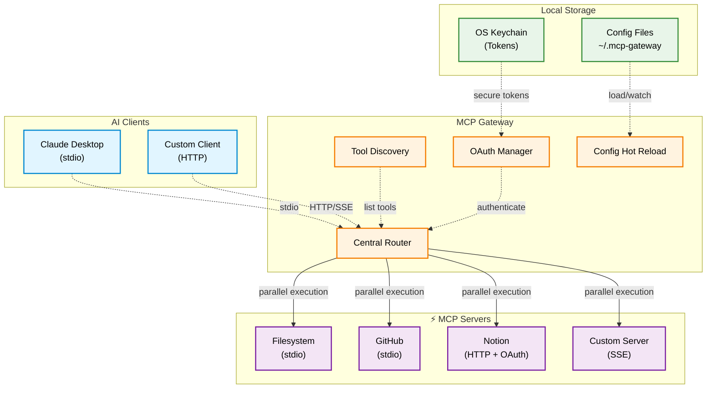

# MCP Gateway

**Unified MCP router that aggregates multiple MCP servers into a single interface for AI agents.**

## Overview

MCP Gateway lets any compatible client talk to multiple Model Context Protocol servers through one entry point. It supports stdio and streamable HTTP transports, manages OAuth flows, and keeps configuration in sync across files with hot reloading.



## Key Features

- **Transport flexibility** – Connect stdio, SSE, and streamable HTTP packages from one router.
- **Parallel execution** – Run multiple tool calls simultaneously with `multi_use_tool` for faster workflows.
- **Secure authentication** – Run built-in OAuth flows with token storage handled by the OS keychain.
- **Config orchestration** – Generate configs automatically, hot-reload changes, and merge multiple files.
- **Discovery & validation** – Inspect tool and package metadata, run health checks, and validate schemas.
- **Structured observability** – Use structured logging with optional file output for debugging sessions.

## Privacy & Security

- Tokens and credentials are stored locally via the system keychain.
- Configuration files may reference environment variables (e.g., `${GITHUB_TOKEN}`) to avoid hardcoding secrets.
- Never commit personal configs or API keys to source control.

## Quick Start

### 1. Add to your MCP-enabled CLI (stdio)
Edit the CLI config to point at MCP Gateway. The CLI will launch the router on demand.

```json
{
  "mcpServers": {
    "mcp-gateway": {
      "command": "npx",
      "args": ["-y", "github:sting8k/mcp-gateway", "--transport", "stdio", "--log-to-file", "--log-level", "info"]
    }
  }
}
```

> `--transport stdio` is required for CLI integrations. `--log-to-file` writes protocol-safe logs to `~/.mcp-gateway/logs/`; adjust `--log-level` as needed.

### 2. Optional: streamable HTTP server
Start MCP Gateway manually if your client prefers HTTP (default port `3001`).

```bash
npx -y github:sting8k/mcp-gateway
```

Then register it with your client:

```json
{
  "mcpServers": {
    "mcp-gateway": {
      "type": "http",
      "url": "http://localhost:3001/mcp"
    }
  }
}
```

### 3. Restart your CLI
`~/.mcp-gateway/config.json` is created automatically on first run.

### 4. Add MCP servers

## Use cli
```bash
npx mcp-gateway add filesystem
npx mcp-gateway add github
```
You can also edit `~/.mcp-gateway/config.json` directly.

## Or edit Configuration file

Example `~/.mcp-gateway/config.json`:

```json
{
  "mcpServers": {
    "filesystem": {
      "command": "npx",
      "args": ["-y", "@modelcontextprotocol/server-filesystem", "/path/to/dir"]
    },
    "github": {
      "command": "npx",
      "args": ["-y", "@modelcontextprotocol/server-github"],
      "env": {
        "GITHUB_PERSONAL_ACCESS_TOKEN": "ghp_xxx"
      }
    },
    "notion": {
      "type": "http",
      "url": "https://mcp.notion.com/mcp",
      "oauth": true
    }
  }
}
```

### Config Options

**Stdio servers**: `command`, `args`, `env`, `cwd`

**HTTP/SSE servers**: `type` (`"http"` or `"sse"`), `url`, `oauth`, `headers`

**Common fields**: `disabled` (boolean), `name`, `description`

### Multiple Config Files

Point MCP Gateway to additional config files via CLI arguments or environment variables:

- **CLI flag**: pass `--config /path/to/one.json --config /path/to/two.json` when launching the router.
- **Environment**: set `MCP_GATEWAY_CONFIG="~/personal.json,~/work.json"` (comma-separated paths) before starting the CLI.

```bash
npx -y github:sting8k/mcp-gateway --config ~/personal.json --config ~/work.json
```
```bash
export MCP_GATEWAY_CONFIG="~/personal.json,~/work.json"
```

## Feature Spotlight

- Single interface for all MCP transports.
- OAuth support with token storage.
- Tool discovery and validation helpers.
- Config hot reload for rapid iteration.
- Built-in help via `get_help(topic: "getting_started")`.

## Community & Resources

- [MCP Specification](https://modelcontextprotocol.io)
- [Available MCP Servers](https://github.com/modelcontextprotocol/servers)
- [Issues & Support](https://github.com/sting8k/mcp-gateway/issues)

## License

MIT License.
